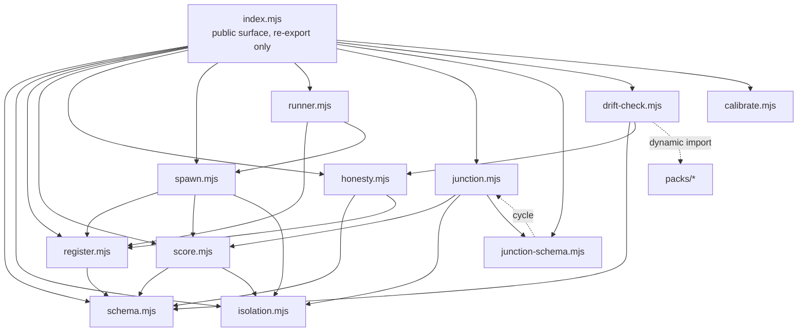

# Architecture

How panelist is put together, and which of its oddities are deliberate.

> **What this document is.** A durable map: module boundaries, the dependency graph, and the design invariants that explain *why* the code looks the way it does. It deliberately contains **no line numbers, no metrics, and no findings** — those go stale on every edit. It needs updating only when a module is added, removed, or re-layered, or when an invariant below stops being true.

## The three planes

panelist invokes a persona three ways. All three consume the **same** persona identity from the register, and none of them bundle a model provider — the client is always injected.

| Plane | Entry point | Shape | Use for |
|---|---|---|---|
| **Programmatic** | `score` / `scoreCandidate` | Every persona x every panelist, aggregated to a keep/cut verdict | Ranking or gating many candidates against a fixed rubric |
| **Agentic, single-turn** | `spawn` / `runPersona` | One persona, one turn, one wrapper | "Would *this* persona stop reading here?" |
| **Agentic, multi-turn** | `runJunctionLoop` | A persona walks a decision graph one junction at a time | "Will you read the next one?" — books, posts, flows |

`runPersona` is a thin front door onto `spawn`, keyed by persona id. It holds no logic of its own, by design — there is one generic runner, not one agent file per persona.

## Module dependency graph

### Layers

| Layer | Modules | May import from |
|---|---|---|
| **L0** pure leaf | `schema`, `isolation` | nothing |
| **L1** state / stats | `register`, `calibrate` | L0 (`calibrate` imports nothing at all) |
| **L2** engines | `score`, `honesty` | L0, L1 |
| **L3** invocation planes | `spawn`, `junction`, `junction-schema` | L0, L1, L2 |
| **L4** front doors | `runner`, `drift-check` | L1, L2, L3 |
| **L5** surface | `index.mjs` | all |

No module imports upward. **There is no filesystem, network, or database access anywhere in `src/`** — the only Node built-ins used in the whole repo are `node:test` and `node:assert` (tests) and `node:url` (the two example CLI guards). `drift-check` is the sole exception and only via dynamic `import()` of the shipped packs.

## Module contracts

| Module | Contract |
|---|---|
| `schema` | Defines and validates the v2 behavioural persona record; sole source of truth for required/forbidden fields and `USAGE_HEADER`. |
| `register` | Composes persona/rubric sources into a process-global registry, last-wins by id, failing fast on a malformed record. |
| `isolation` | Resolves a requested tool allowlist into an effective deny-by-default set, and returns a gate that decides and records denials. |
| `score` | Runs the persona x panelist matrix against a rubric; returns a keep/cut verdict — aggregated from the panel when enough of it reports, pinned closed when not — with a cross-model flag. |
| `spawn` | Invokes one registered persona for one model turn; returns the fixed invocation-contract wrapper. |
| `runner` | Resolves a persona by id and delegates to `spawn`. Holds no logic of its own. |
| `junction` | Walks a persona through a decision graph one junction at a time behind a structural information barrier, until bail / terminal / budget-exhausted / invalid-decision. |
| `junction-schema` | Defines the interpretation-free per-turn reaction and run-level trace shapes; aggregates traces without collapsing dispersion. |
| `honesty` | Stamps, renders, and asserts the honesty caveat on panel output. |
| `calibrate` | Joins synthetic per-persona scores to an injected real signal; ranks personas by predictive usefulness. |
| `drift-check` | Validates this repo's own persona records against the schema; reports invalid and duplicate ids. |

## Design invariants

These explain the code's non-obvious choices. **Several look like defects and are not** — check here before "fixing" one.

### No provider is bundled, ever

The model client is injected at every call site, and the default client **throws** rather than running un-modelled. This is why there are no API keys, no HTTP client, and no runtime dependencies. Tests inject mocks; production injects a PromptFoo/LiteLLM-style adapter.

### Isolation is deny-by-default and closed under discovery

A persona is a cold reader; that signal only holds if it knows nothing beyond the artifact. So: no tools unless explicitly named, exact-match allowlist, **wildcards throw** rather than silently granting, and a tool-discovery capability is itself a tool that must be named explicitly. Denied attempts are *reported* in `isolation.denied`, never swallowed — a contaminated run must be visible, not indistinguishable from a clean one.

### The junction barrier is structural, not conventional

The loop only ever touches the junction it is standing on, and resolves that junction's content lazily. It never iterates all junctions and never pre-assembles the graph. An unchosen junction's content **cannot** leak into a prompt because no code path reads it. A sentinel test asserts this directly.

### Engine emits mechanics; consumers own interpretation

`junction-schema`'s trace carries only what happened: which junction, how engaged, what was chosen, where it stopped. No verdicts, no severities, no scores. All interpretation lives in the consumer's `onComplete` hook. The trace and per-turn reaction have **locked key sets asserted by tests** — adding a field to either breaks the split on purpose. If you want a consumer-specific field in the trace, it belongs in your hook instead.

### Dispersion is never averaged away

`aggregateJunctionTraces` returns a drop-off histogram and per-junction engagement counts — never a mean, score, star, or pass-rate. A consumer who wants a headline number computes it themselves and owns that reductive choice.

### The error-handling asymmetry is deliberate

| Module | Behavior | Why |
|---|---|---|
| `register` | **Throws** on a malformed record | A runtime compose call has a caller to hand the error to; degrading to empty would hide the bug |
| `drift-check` | **Never throws**; reports instead | A validator that dies on the first bad record can't report the rest |
| `spawn` / `junction` | **Throw** on an unusable client response | One persona failing has no panel to fall back on |
| `score` | **Counts** failures in `panelistsFailed` and continues | Attrition is data, not a crash; the survivors are still reported, and the verdict pins closed when too few of them are |

All four are correct. Don't unify them.

### Some duplication is load-bearing

`mean` and `round2` exist in both `score` and `calibrate`. This is deliberate and commented: de-duplicating would mean widening `score`'s public surface to export numeric helpers, which is the worse trade.

(`normalizeReportedDenial` is duplicated across three modules and is **not** in this category — it should be consolidated into `isolation`.)

### The registry is a process-global singleton

`registerPersonas` composes into module-level state, last-wins by id. This replaced a bundled roster so consumers can layer private personas over public packs at runtime. `clearRegistry()` exists for test isolation. The known limitation: two consumers in one long-lived process will override each other, and the composed usage header is registration-order dependent.

## Known structural issues

Tracked rather than hidden. Remove a row when its issue closes.

| Issue | What |
|---|---|
| Circular import | `junction` and `junction-schema` import from each other. Currently benign — neither dereferences the other's bindings at module-evaluation time — but it is safe by accident of where the references sit. |
| Shared helpers live in `score` | `spawn` and `junction` import `renderPersona` and `extractJsonObject` from `score`. Two sibling planes depending on a third for shared primitives; those helpers are not scoring concerns. |

## Where the contract is written down

The invocation-contract wrapper shape is currently stated in **three** places with nothing binding them: `docs/invocation-contract.md`, `.claude/agents/persona.md`, and the JSDoc on `spawn`. A change to the wrapper must update all three by hand.
